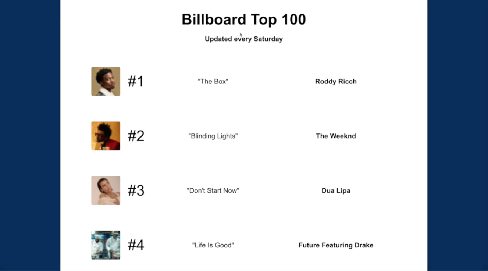

# **Advice Wiki**

This is an MVP project I completed as a student at [Hack Reactor](http://hackreactor.com).

[Video demonstration](https://youtu.be/f342U9WhLaI)

React | Node | Express | MongoDB | AWS | Emotion

CRUD single-page application providing mentors a way to give advice to mentees

- Alleviated cross-site scripting vulnerabilities by sanitizing input from submission forms
- Deployed via AWS EC2 instance; scored 100 on Google PageSpeed Insights
- Implemented tabular user interface to organize lists; smooth scrolling to improve user experience

